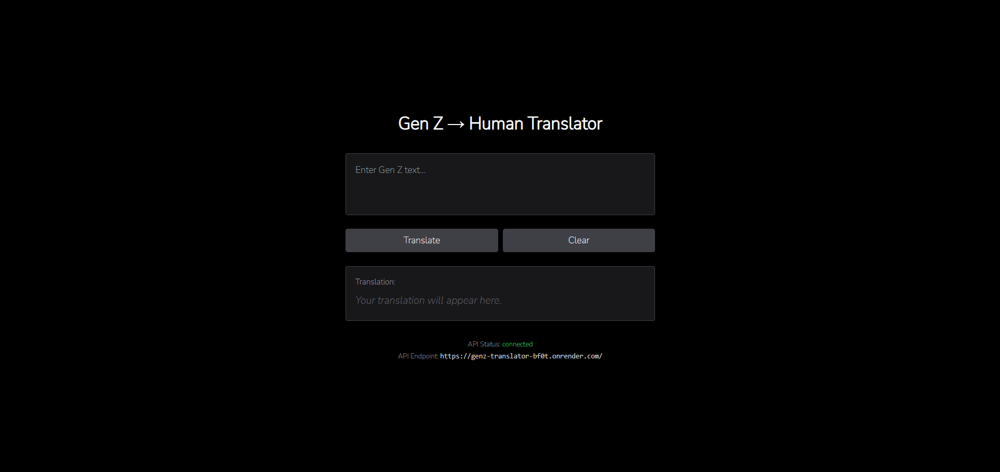

# Gen Z → Human Translator

A web app that translates Gen Z slang into standard English. Built with React, Spring Boot, PostgreSQL, and Docker.



## Quick Start
```bash
git clone https://github.com/yourusername/genz-translator.git
cd genz-translator
docker compose up -d
```
- React UI on http://localhost:3000
- Spring Boot API on http://localhost:8080
- Local Postgres seeded from `database/init.sql`

## What You Get
- Real-time Gen Z → human translations
- JWT auth + profile personas
- Community vibes, pulses, and remixes

## Built With
- React 18 + Tailwind UI
- Spring Boot 3 + JWT security
- PostgreSQL 15 + Docker Compose